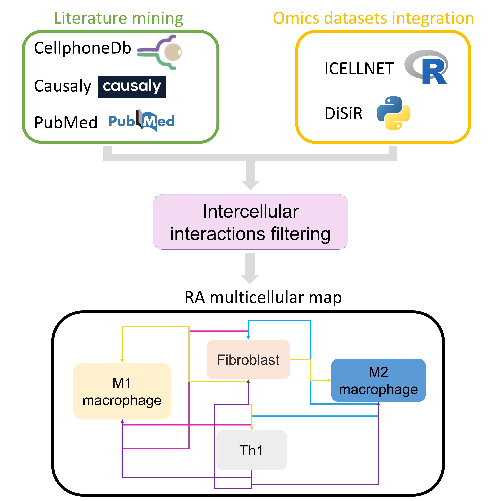

# Large-scale multicellular modeling of the arthritic joint 

In this directory, you will find all the files and scripts used to generate the RA multicellular map, calibrate the RA Th1 and RA fibroblast models and perform in silico simulations on the validated models.

This folder consists of:

#1.Molecular_interaction_maps: 
contains the XML files of the molecular interaction maps used to generate the corresponding Boolean models using CaSQ. 
The XML files are converted to JSON files using the following command casq -b -g 1 $XML_file_name $JSON_file_name
example:
casq -b -g 1 RA_M1_macrophage.xml RA_M1_macrophage.json

#2. Intercellular interactions identification : 
contains the scripts for the identification of cellular communication used to build the RA multicellular map. We used for that CellPhoneDB, ICELLNET and DiSiR as described in this figure : 

#3. Datasets: 
contains the gene expression datasets used in this project.

#4. Models calibration : This work is based on the framework proposed by Zerrouk et al.,2023.

For a more detailed description of this framework, please use this link:  https://gitlab.com/genhotel/Large_scale_computational_modelling_of_the_M1_and_M2_synovial_macrophages_in_Rheumatoid_Arthritis 

#5. In_silico_simulations : 
contains scripts and files used to perform in silico simulations on the calibrated multicellular model. First you need to unzip the BMA.zip file. It contains the calibrated JSON file of the model and the console tool. Python scripts are used to run the simulations using BMA: Simulations_with_console_tool_one_by_one.py runs the mono drug simulations while Simulations_with_console_tool_two_by_two.py runs the combined drugs simulations.
The R scripts are used to analyze the simulations results : One_by_one_drugs_simulations_analysis.R identifies the perturbed nodes at each mono drug simulation, Two_by_two_drugs_simulations_analysis.R identifies the drug pairs that perturb the model's phenotypes 
